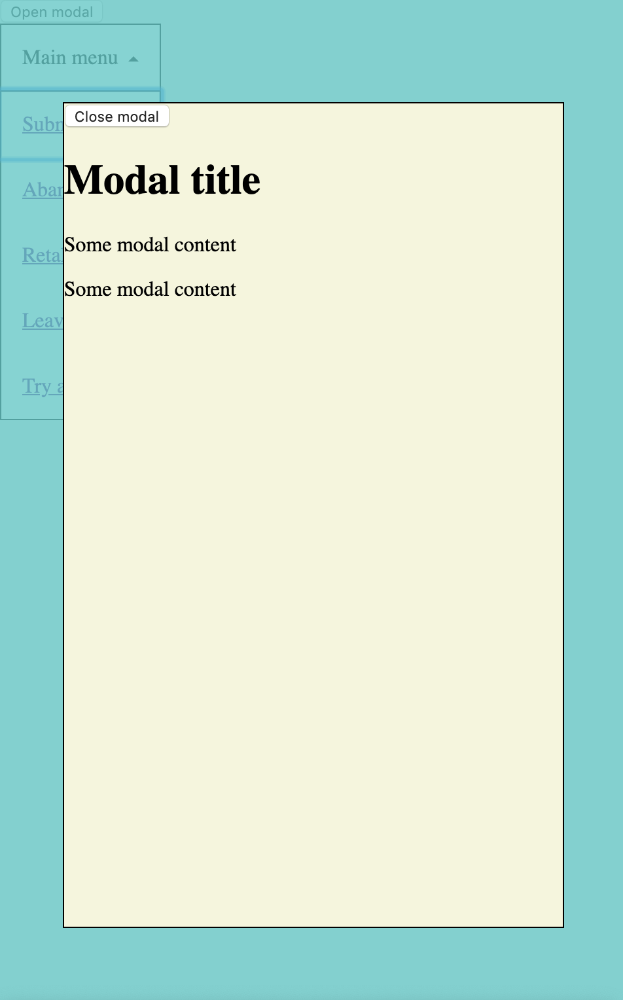

# 2019-09-05_CSS-IN-DEPTH_Modal-and-dropdown-positioning-and-z-index

[See it live](https://jfhector.github.io/cheat-sheets/code_examples/2019-09-05_CSS-IN-DEPTH_Modal-and-dropdown-positioning-and-z-index/index.html)

## Snapshots

<figure>
  <figcaption>The modal above the dropdown, both absolutely positioned</figcaption>
  
</figure>

## What does it demonstrate?

### Using CSS variables to keep `z-indez` values in one place

```
html {
    box-sizing: border-box;
    --z-index--drop-down: 100;
    --z-index--modal--backdrop: 200;
    --z-index--modal--content-container: 210;
}
```

### Creating a drop-down arrow from CSS

```
.drop-down::after {
    content: '';
    border: 4px solid;
    border-color: black transparent transparent transparent;
    height: 0;
    width: 0;
    position: absolute;
    right: 1em;
    top: 1.5em;
    transition: 100ms ease-in-out;
}

.drop-down:hover::after,
.drop-down:focus-within::after {
    transform: rotate(0.5turn);
    top: calc(1.5em - 4px);
}
```

### Showing and hiding a dropdown using just CSS, when `focus-within` is supported

```
.drop-down:hover > .drop-down-options,
.drop-down:focus-within > .drop-down-options {
    display: block;
}
```

## Notes

* `z-index` only has effect on absolutely-positioned elements.
* Positioned elements (e.g. `position: absolute`, `relative`) are painted on a different layer, above static elements. By default (i.e. if `z-index` hasn't been used to modified this), their order within positioned elements on the z axis comes from the source order.

