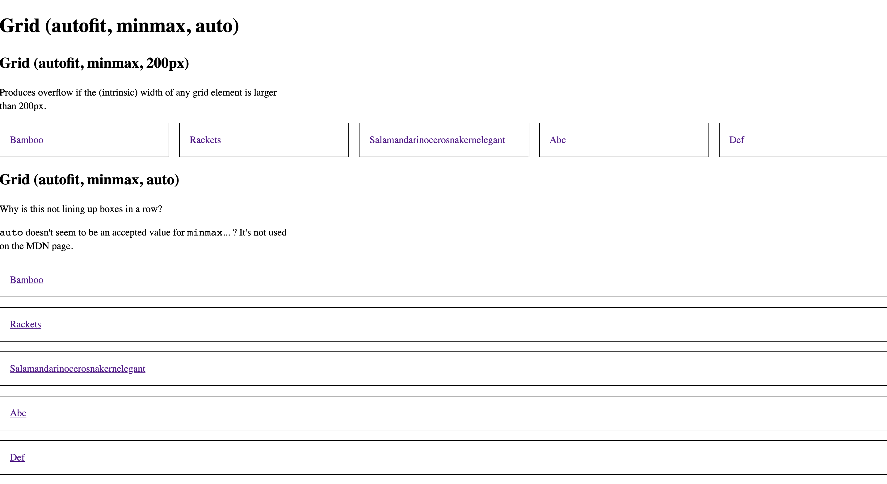

# 0906-Q-Grid-using-auto-in-minmax

[See it live](https://jfhector.github.io/cheat-sheets/code_examples/2019Q4/0906-Q-Grid-using-auto-in-minmax/index.html)

## Snapshots

<figure>
  <figcaption>Layout</figcaption>
  
</figure>

## What does it demonstrate?

* Reduced test case

## Notes

* Why isn't using Grid with repeat autofit and auto in minmax not lining up boxes in a row? (Grid with repeat autofit and 200px in minmax does).
  * <code>auto</code> doesn't seem to be an accepted value for <code>minmax</code>... ? It's not used on the MDN page.

