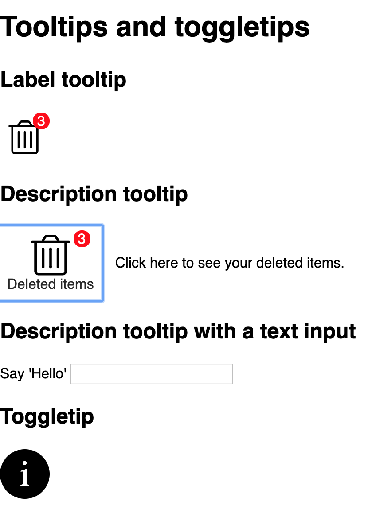

# 0921HIC-Tooltips_and_toggletips

[See it live](https://jfhector.github.io/cheat-sheets/code_examples/2019Q4/0921HIC-Tooltips_and_toggletips/index.html)

## Snapshots

<figure>
  <figcaption>Label tooltip, description tooltip and toggletip</figcaption>
  
</figure>

## Possible improvements

* I'd rather not use `data-module="..."` attributes when I'm not using them in JS, because to me they imply that they are JS hooks. Use a `class` instead.

## Usage notes

I made some slight tweaks to the .css file directly, rather than the .scss file, by mistake:
* supporting the `input` element for the description tooltip
* adjusting the `left` positioning property for the description tooltip

## Notes

### Making a label tooltip and description tooltip

Note: Label tooltips don't help touch users. As such, they are only OK if pressing the wrong button doesn't have consequences (e.g. for tabs in an app).

Possible improvement: I'd rather not use `data-module="..."` attributes when I'm not using them in JS, because to me they imply that they are JS hooks. Use a `class` instead.

```html
<div data-module="description-tooltip">
    <button class="stack-0.5" aria-describedby="description" aria-labelledby="badge label">
        
        <span id="label">Deleted items</span>
    </button>
    
    <span id="badge" aria-hidden="true">3</span>
    <span id="description" role="tooltip">Click here to see your deleted items.</span>
</div>
```

```css
[data-module=description-tooltip] {
  position: relative;
  width: max-content;
}

[data-module=description-tooltip] > [role=tooltip] {
  position: absolute;
  min-width: max-content;
  top: 50%;
  /* left: 7rem; */
  left: calc(100% + 1rem); /* I prefer this */
  transform: translateY(-50%);
  display: none;
}

[data-module=description-tooltip]:hover > [role=tooltip],
[data-module=description-tooltip] > button:focus ~ [role=tooltip],
[data-module=description-tooltip] > input:focus ~ [role=tooltip] {
  display: block;
}
```

### When making a toggletip, delete the `innerHTML` of a `<span role="status"></span>`, then repopulate it after a 100ms `setTimeout`. Take the content from a `data-toggle-tip-content` attribute on the button

HTML:
```html
<div data-module="toggle-tip">
    <button type="button" data-toggle-tip-content="Notifications will tell you about activity going on in the app, like receiving messages or likes">
        <span aria-hidden="true">i</span>
        <span class="!visually-hidden">More information</span>
    </button>
    
    <span role="status"></span>
</div>
```

JS:
```js
function show() {
    $liveRegion.innerHTML = '';
    setTimeout(() => {
        $liveRegion.innerHTML = `<span">${toggleTipContent}</span>`;
    }, 100);
}
```

### Dismiss a toggletip on escape and when a click is registered anywhere outside the toggle button, by listening for `click` events on the `document`, and checking whether `$toggleButton.contains(e.target)`

```js
document.addEventListener('click', (e) => {
    if (!$toggleButton.contains(e.target)) {
        hide();
        e.stopPropagation();
    }
});

document.addEventListener('keyup', (e) => {
    if (e.key === 'Escape') {
        hide();
    }
});
```

### Making a notification badge. And using `aria-labelledby` to label an element using two elements (not just one), and potentially aria-hidden to avoid repetition

Note how the badge is included in `aria-labelledby`, together with the label.

```html
<div data-module="label-tooltip">
    <button aria-labelledby="badge label">
        
    </button>
    
    <span id="badge" aria-hidden="true">3</span>
    <span id="label" role="tooltip">Deleted items</span>
</div>
```

```css
[aria-hidden=true] {
  position: absolute;
  right: 0;
  background-color: red;
  color: white;
  border-radius: 50%;
  width: 1.2em;
  height: 1.2em;
  text-align: center;
  line-height: 1.3;
}
```

### Combining `aria-hidden="true"` and `class="!visually-hidden"` to create a text alternative to an icon

```html
<button type="button" data-toggle-tip-content="Notifications will tell you about activity going on in the app, like receiving messages or likes">
    <span aria-hidden="true">i</span>
    <span class="!visually-hidden">More information</span>
</button>
```

### Resetting a `button`'s styles, and styling it the way I want

```css
[data-module=label-tooltip] > button {
  -webkit-appearance: none;
  -moz-appearance: none;
  appearance: none;
  background-color: white;
  border: none;
  width: 3.5rem;
  height: 3.5rem;
  padding: 0.5rem;
}
```
