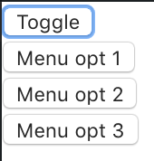
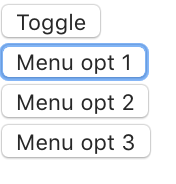

# 0922rjs-focus_within_alt_in_js

[See the CodeSandbox](https://codesandbox.io/s/tmnmh)

## Snapshots

<figure>
  <figcaption>Focus event on any button within the container shows all the buttons</figcaption>
  
</figure>

<figure>
  <figcaption>Focus event on the first button reveals the next buttons</figcaption>
  
</figure>

## Notes

### I can use focus events, blur events, setTimeout and clearTimeOut to achieve something similar to `:focus-within`

* I listen for both `focus` events and `blur` events on a div that contains a toggle button, as well as the option buttons that it discloses.
  * Clicking / focusing outside of the container should set `isOpen` to `false`
  * ... but clicking / focusing on another button **within the container** should **not** set `isOpen` to `false`, but to `open`.
* If `blur` events just set `isOpen` to `false`, it'd become false everytime that a button loses focus when another button within the container gains focus. There would be a flicker, where the blur event closes the disclosure, before the focus event immediately opens it again. We don't want that
* The trick is to, **on `blur`, schedule setting `isOpen` to `false` at the next tick, leaving the opportunity for the `focus` event that happens just after to cancel that timeout**.
* To schedule setting `isOpen` to `false` at the next tick, I can use `setTimeout` with no delay argument. Then clear that time out on focus


```js
  timeOutId: number | undefined = undefined;

  handleFocus(e: React.FocusEvent) {
    clearTimeout(this.timeOutId);
    this.setState({ isOpen: true });
    e.stopPropagation();
  }

  handleBlur(e: React.FocusEvent) {
    this.timeOutId = setTimeout(
      () => {this.setState({ isOpen: false })}
    );
    e.stopPropagation();
  }
```

```js
<div onFocus={this.handleFocus} onBlur={this.handleBlur}>
<button type="button">Toggle</button>

{isOpen && <>
    <div>
    <button type="button">Menu opt 1</button>
    </div>

    <div>
    <button type="button">Menu opt 2</button>
    </div>
    
    <div>
    <button type="button">Menu opt 3</button>
    </div>
</>}
</div>
```

### Declaring a new property in TS on a React Component class

When using TypeScript with strict checks, declaring a new class property within the constructor gives an error saying that this property doesn't exist on the component.

#### Solution 1: Use the Public Class Fields syntax, rather than an explicit constructor

#### Solution 2: Symply declare + assign the property *outside* the constructor, like I also define methods

```js
export class ToggleButton extends React.Component<{}, State> {
  constructor(props: {}) {
    super(props);

    this.state = {
      isOpen: false
    };

    this.handleFocus = this.handleFocus.bind(this);
    this.handleBlur = this.handleBlur.bind(this);
  }

  timeOutId: number | undefined = undefined;

  ...
```

### The type of timeOutIds is number | underined

```js
timeOutId: number | undefined = undefined;

handleFocus(e: React.FocusEvent) {
    clearTimeout(this.timeOutId);
    this.setState({ isOpen: true });
    e.stopPropagation();
}
```
