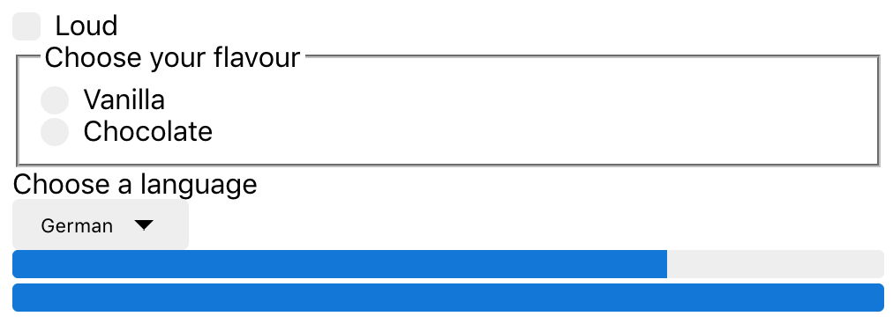

# 1011WTFF-Checkbox_Radio_Select_Progress

[See it live](http://jfhoct11tests.now.sh)

Source: [WTF Forms](http://wtfforms.com/)

## Snapshots

<figure>
  <figcaption>A checkbox, a radio group, a select and two progress bars</figcaption>
  
</figure>

## What does it demonstrate?

* How to style these elements across browsers
* How to implement them with React, SCSS, TS

## Notes

### Type safety on arrays, by defining the type of valid array options first

To get decent type safety on an array of options, I can first define a type for a valid array option, then say that the variable containing the array is an array of element of that type.

```ts
export type Language_Option = 'French' | 'German' | 'English' | 'Spanish' | 'Georgian' | 'Swiss';
export const language_options: Language_Option[] = ['German', 'French', 'English', 'Spanish', 'Georgian', 'Swiss'];
```

### Type safety on Reacte `useState`, using a generic type parameter

The `useState` hook is a function that accepts a generic type parameter, corresponding to the type of a valid state.

```ts
const [checkboxChecked, setCheckboxChecked] = useState(false);
const [flavourRadioChecked, setFlavourRadioChecked] = useState<keyof typeof flavour | undefined>(undefined);
const [selectedLanguage, setLanguage] = useState<Language_Option | undefined>();
```

### Making, styling and using a checkbox

#### Consuming the Checkbox:

```tsx
const [checkboxChecked, setCheckboxChecked] = useState(false);
const handleCheckboxChange = () => { setCheckboxChecked(!checkboxChecked); };

...

<Checkbox checked={checkboxChecked} onChange={handleCheckboxChange}>
  Loud
</Checkbox>
```

#### Defining the Checkbox:

```ts
type Props = {
    children: string,
    checked: boolean,
    onChange: (e: ChangeEvent<HTMLInputElement>) => void,
    readonly?: boolean
    disabled?: boolean
    inline?: boolean
}

export const Checkbox: React.FC<Props> = ({
    children,
    checked,
    onChange,
    readonly = false, 
    disabled = false,
    inline = false,
}) => {
    return (
        <label className={classNames('Checkbox', {'Checkbox--inline': inline})}>
            <input type="checkbox" 
            checked={checked}
            onChange={onChange}
            disabled={disabled}/>

            <span className="control-indicator" />

            {children}
        </label>
    );
}
```

```scss
@import './../shared_form_styles.scss';

.Checkbox {
    @extend .control;
}

.Checkbox--inline {
    display: inline-block;
}

.control-indicator {
    .Checkbox > & {
        border-radius: 0.25rem;
    }

    .Checkbox > input:checked ~ & {
        background-image: url(data:image/svg+xml;base64,PD94bWwgdmVyc2lvbj0iMS4wIiBlbmNvZGluZz0idXRmLTgiPz4NCjwhLS0gR2VuZXJhdG9yOiBBZG9iZSBJbGx1c3RyYXRvciAxNy4xLjAsIFNWRyBFeHBvcnQgUGx1Zy1JbiAuIFNWRyBWZXJzaW9uOiA2LjAwIEJ1aWxkIDApICAtLT4NCjwhRE9DVFlQRSBzdmcgUFVCTElDICItLy9XM0MvL0RURCBTVkcgMS4xLy9FTiIgImh0dHA6Ly93d3cudzMub3JnL0dyYXBoaWNzL1NWRy8xLjEvRFREL3N2ZzExLmR0ZCI+DQo8c3ZnIHZlcnNpb249IjEuMSIgaWQ9IkxheWVyXzEiIHhtbG5zPSJodHRwOi8vd3d3LnczLm9yZy8yMDAwL3N2ZyIgeG1sbnM6eGxpbms9Imh0dHA6Ly93d3cudzMub3JnLzE5OTkveGxpbmsiIHg9IjBweCIgeT0iMHB4Ig0KCSB2aWV3Qm94PSIwIDAgOCA4IiBlbmFibGUtYmFja2dyb3VuZD0ibmV3IDAgMCA4IDgiIHhtbDpzcGFjZT0icHJlc2VydmUiPg0KPHBhdGggZmlsbD0iI0ZGRkZGRiIgZD0iTTYuNCwxTDUuNywxLjdMMi45LDQuNUwyLjEsMy43TDEuNCwzTDAsNC40bDAuNywwLjdsMS41LDEuNWwwLjcsMC43bDAuNy0wLjdsMy41LTMuNWwwLjctMC43TDYuNCwxTDYuNCwxeiINCgkvPg0KPC9zdmc+DQo=);
    }
}
```

shared_form_styles.css:

```scss
.control {
    position: relative;
    padding-left: 1.5rem;
    display: block;
    cursor: pointer;
}

.control--inline {
    display: inline-block;
}

.control > input {
    position: absolute;
    z-index: -1;
    opacity: 0;
}

.control-indicator {
    position: absolute;
    top: 0.15rem;
    left: 0;
    width: 1rem;
    height: 1rem;
    line-height: 1rem;
    // font-size: 65%;
    // color: #eee;
    // text-align: center;
    background-color: #eee;
    background-size: 50% 50%;
    background-position: center center;
    background-repeat: no-repeat;

    // States
    .control:hover > & {
        color: #fff;
        background-color: #ccc;
    }

    .control > input:focus ~ & {
        box-shadow:
            0 0 0 0.075rem #fff,
            0 0 0 0.2rem #0074d9;
    }

    .control > input:checked ~ & {
        color: #fff;
        background-color: #0074d9;
    }

    .control > input:active ~ & {
        color: #fff;
        background-color: #84c6ff;
    }
}
```

### Making, styling and using radio buttons

#### Consuming the radio buttons:

```ts
export const flavour = {
  vanilla: 'Vanilla',
  chocolate: 'Chocolate',
}
```

```tsx
const [flavourRadioChecked, setFlavourRadioChecked] = useState<keyof typeof flavour | undefined>(undefined);
const handleFlavourRadioChange = (e: ChangeEvent<HTMLInputElement>) => { setFlavourRadioChecked(e.target.value as keyof typeof flavour); };

...

<fieldset>
  <legend>Choose your flavour</legend>

  <RadioButton name="flavour" checked={flavourRadioChecked === flavour.vanilla} onChange={handleFlavourRadioChange}>
    {flavour.vanilla}
  </RadioButton>

  <RadioButton name="flavour" checked={flavourRadioChecked === flavour.chocolate} onChange={handleFlavourRadioChange}>
    {flavour.chocolate}
  </RadioButton>
</fieldset>
```

#### Defining the Checkbox:

```ts
type Props = {
    children: string,
    name: string,
    checked: boolean,
    onChange: (e: ChangeEvent<HTMLInputElement>) => void,
    readonly?: boolean
    disabled?: boolean
    inline?: boolean
}

export const RadioButton: React.FC<Props> = ({
    children,
    name,
    checked,
    onChange,
    readonly = false, 
    disabled = false,
    inline = false,
}) => {

    return (
        <label 
            className={classNames('RadioButton', {'RadioButton--inline': inline})}>
            <input type="radio" 
            name={name}
            value={children}
            checked={checked}
            onChange={onChange}
            disabled={disabled}/>

            <span className="control-indicator" />

            {children}
        </label>
    );
}
```

```scss
@import './../shared_form_styles.scss';

.RadioButton {
  @extend .control;
}

.RadioButton--inline {
  display: inline-block;
}

.control-indicator {
  .RadioButton > & {
      border-radius: 50%;
  }

  .RadioButton > input:checked ~ & {
      background-image: url(data:image/svg+xml;base64,PD94bWwgdmVyc2lvbj0iMS4wIiBlbmNvZGluZz0idXRmLTgiPz4NCjwhLS0gR2VuZXJhdG9yOiBBZG9iZSBJbGx1c3RyYXRvciAxNy4xLjAsIFNWRyBFeHBvcnQgUGx1Zy1JbiAuIFNWRyBWZXJzaW9uOiA2LjAwIEJ1aWxkIDApICAtLT4NCjwhRE9DVFlQRSBzdmcgUFVCTElDICItLy9XM0MvL0RURCBTVkcgMS4xLy9FTiIgImh0dHA6Ly93d3cudzMub3JnL0dyYXBoaWNzL1NWRy8xLjEvRFREL3N2ZzExLmR0ZCI+DQo8c3ZnIHZlcnNpb249IjEuMSIgaWQ9IkxheWVyXzEiIHhtbG5zPSJodHRwOi8vd3d3LnczLm9yZy8yMDAwL3N2ZyIgeG1sbnM6eGxpbms9Imh0dHA6Ly93d3cudzMub3JnLzE5OTkveGxpbmsiIHg9IjBweCIgeT0iMHB4Ig0KCSB2aWV3Qm94PSIwIDAgOCA4IiBlbmFibGUtYmFja2dyb3VuZD0ibmV3IDAgMCA4IDgiIHhtbDpzcGFjZT0icHJlc2VydmUiPg0KPHBhdGggZmlsbD0iI0ZGRkZGRiIgZD0iTTQsMUMyLjMsMSwxLDIuMywxLDRzMS4zLDMsMywzczMtMS4zLDMtM1M1LjcsMSw0LDF6Ii8+DQo8L3N2Zz4NCg==);
  }
}
```

shared_form_styles.css:

```scss
.control {
    position: relative;
    padding-left: 1.5rem;
    display: block;
    cursor: pointer;
}

.control--inline {
    display: inline-block;
}

.control > input {
    position: absolute;
    z-index: -1;
    opacity: 0;
}

.control-indicator {
    position: absolute;
    top: 0.15rem;
    left: 0;
    width: 1rem;
    height: 1rem;
    line-height: 1rem;
    // font-size: 65%;
    // color: #eee;
    // text-align: center;
    background-color: #eee;
    background-size: 50% 50%;
    background-position: center center;
    background-repeat: no-repeat;

    // States
    .control:hover > & {
        color: #fff;
        background-color: #ccc;
    }

    .control > input:focus ~ & {
        box-shadow:
            0 0 0 0.075rem #fff,
            0 0 0 0.2rem #0074d9;
    }

    .control > input:checked ~ & {
        color: #fff;
        background-color: #0074d9;
    }

    .control > input:active ~ & {
        color: #fff;
        background-color: #84c6ff;
    }
}
```

### Types of change events (for checkboxes, radios, selects)

```tsx
const handleSelectedLanguageChange = (e: ChangeEvent<HTMLSelectElement>) => { ... }
```

### Making, styling and using select components

#### Using it

```ts
export type Language_Option = 'French' | 'German' | 'English' | 'Spanish' | 'Georgian' | 'Swiss';
export const language_options: Language_Option[] = ['German', 'French', 'English', 'Spanish', 'Georgian', 'Swiss'];
```

```tsx
const [selectedLanguage, setLanguage] = useState<Language_Option | undefined>();

const handleSelectedLanguageChange = (e: ChangeEvent<HTMLSelectElement>) => {
  const selectedValue = e.target.value;
  if (language_options.includes(selectedValue as Language_Option)) {
    setLanguage(selectedValue as Language_Option);
  }
  // TODO: Is there a clearer and safer way of doing this?
};
```

#### Defining it

```tsx
type Props = {
  options: string[]
  value: string | undefined
  onChange: (e: ChangeEvent<HTMLSelectElement>) => void
  id: string
  optionSelectedByDefault?: string
  inline?: boolean
}

export const Select: React.FC<Props> = ({
  options,
  value,
  onChange,
  id,
  inline = false,
}) => {

  return (
    <div className={classNames('Select', {'Select--inline': inline})}>
      <select id={id} value={value} onChange={onChange}>
        {options.map(option => <option key={option} value={option}>{option}</option>)}
      </select>
    </div>
  );
}
```

```scss
.Select {
  position: relative;

  &:after {
    position: absolute;
    top: 50%;
    right: 1.25rem;
    margin-top: -0.15rem;
    // display: inline-block; // It's already the case, at least in Chrome
    content: '';
    width: 0;
    height: 0;
    pointer-events: none;
    border: 0.35rem solid transparent;
    border-top-color: black;
  }

  select {
    display: inline-block;
    width: 100%;
    margin: 0;
    padding: 0.5rem 2.25rem 0.5rem 1rem;
    background-color: #eee;
    border: 0;
    border-radius: 0.25rem;
    cursor: pointer;
    outline: 0;
    appearance: none;

    &:hover {
      background-color: #ddd;
    }

    &:focus {
      box-shadow:
        0 0 0 0.075rem #fff,
        0 0 0 0.2rem #0074d9;

      &:-moz-focusring { /* Undo the Firefox inner focus ring */
        color: transparent;
        text-shadow: 0 0 0 #000;
      }
    }

    &:active {
      color: #fff;
      background-color: #0074d9;
    }

    &::-ms-expand { /* Hide the arrow in IE10 and up */
      display: none;
    }
  }
}

.Select--inline {
  display: inline-block;
}
```

### Making, styling and using a progress indicator

#### Using it

```tsx
<Progress value={75}/>

<Progress value={100}/>
```

#### Defining it

```tsx
type Props = {
  value: number,
  max?: number,
}

export const Progress: React.FC<Props> = ({
  value,
  max = 100
}) => {

  return (
    <progress className='Progress' value={value} max={max}>{value}</progress>
  );
}
```

```scss
.Progress {
  width: 100%; /* The width is automatically set by the browser to a value that is not 100% */
  display: inline-block;
  height: 1rem;
  appearance: none;

  &::-webkit-progress-bar {
    background-color: #eee;
    border-radius: 0.2rem;
  }

  &::-webkit-progress-value {
    background-color: #0074d9;
    border-top-left-radius: 0.2rem;
    border-bottom-left-radius: 0.2rem;
  }

  &[value='100']::-webkit-progress-value {
    border-top-right-radius: 0.2rem;
    border-bottom-right-radius: 0.2rem;
  }

  /* Firefox styles */
  background-color: #eee;
  border-radius: 0.2rem;
  border: 0; /* Remove Firefox and Opera border */

  &::-moz-progress-bar {
    background-color: #0074d9;
    border-top-left-radius: .2rem;
    border-bottom-left-radius: .2rem;
  }

  &[value='100']::-moz-progress-bar {
    border-top-right-radius: .2rem;
    border-bottom-right-radius: .2rem;
  }

  /* IE styles */
  /* IE10 uses `color` to set the bar background-color */
  color: #0074d9;
}
```

### Using scss `@extend`

#### How `@extend` works

```scss
.Checkbox {
    @extend .control;
}
```

By doing this, it's not that all the rules defined in `.control` get copied and pasted under `.Checkbox`.
Instead, it's `.Checkbox` that gets added as a selector for declaration blocks, everywhere that `.control` is used as a selector.
In effect, it means that every declaration block that an element with a class `control` matches, elements with class `Checkbox` will now match too.
So, by extending `.control` inside `.Checkbox { ... }`, I don't only get these declarations matching:

```scss
.control {
    position: relative;
    padding-left: 1.5rem;
    display: block;
    cursor: pointer;
}
```

... but I also get all of these potentially, as if `.Checkbox` was now an alias for `.control`:

```scss
.control > input {
    position: absolute;
    z-index: -1;
    opacity: 0;
}

.control-indicator {
    position: absolute;
    top: 0.15rem;
    left: 0;
    width: 1rem;
    height: 1rem;
    line-height: 1rem;
    // font-size: 65%;
    // color: #eee;
    // text-align: center;
    background-color: #eee;
    background-size: 50% 50%;
    background-position: center center;
    background-repeat: no-repeat;

    // States
    .control:hover > & {
        color: #fff;
        background-color: #ccc;
    }

    .control > input:focus ~ & {
        box-shadow:
            0 0 0 0.075rem #fff,
            0 0 0 0.2rem #0074d9;
    }

    .control > input:checked ~ & {
        color: #fff;
        background-color: #0074d9;
    }

    .control > input:active ~ & {
        color: #fff;
        background-color: #84c6ff;
    }
}
```

#### When to use `@extend`, when when to use two class names

`@extend` helps me avoid adding ancestor classes in HTML:

Because I've done this:

```scss
.Checkbox {
    @extend .control;
}
```

... I don't need to do this any more:

```tsx
<label className='control Checkbox'>
```

... I can do just this:

```tsx
<label className='Checkbox'>
```

So, what about when I use a modifier?

i.e. I could use `@extend` further to do this:

```tsx
<label className={classNames({'Checkbox': !inline, 'Checkbox--inline': inline})}>
```

But that seems too complicated, and counter intuitive.

So instead, I do:

```tsx
<label className={classNames('Checkbox', {'Checkbox--inline': inline})}>
```

In summary, I use `@extend` to avoid having to assign classes for (abstract) parents of the CSS component I want.
But I don't use it for modifiers (I use two CSS classes instead).
