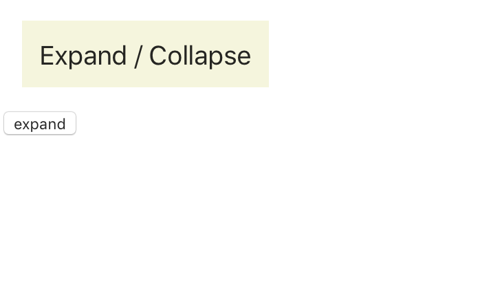
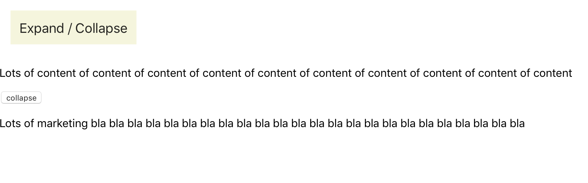
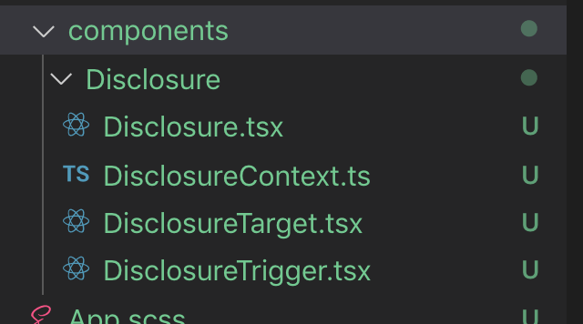

# 1015TUI-Disclosure

[See it live](https://tui1015disclosure.now.sh/)

It's a simplification of TenonUI's `Disclosure` component. I believe that it's as robust (but I haven't written test), it just has less non-essential features.

## Possible bug

* In both the `DisclosureTrigger` and `DisclosureTarget` components, when I'm intending to pass all non-intercepted props to the underlying nodes, I'm actually passing down **all** the parent component's props, including the `props.children` (so this one get passed down twice then, I guess). It doesn't result in a visible bug but it should be improved, it's v easy. See below (### Forwarding all props (except the ones I'm intercepting) to another component).

## Snapshots

<figure>
  <figcaption>Both disclosures collapsed</figcaption>
  
</figure>

<figure>
  <figcaption>Both disclosures expanded</figcaption>
  
</figure>

### Using the React Context API to share state and/or actions between a ancestor component and one or more of its descendant components

1. import `React.createContext` and instanciate a context object in a separate file, so that I can import it across different components.
   
  createContext takes a generic type parameter corresponding to the type of the context value.

<figure>
  <figcaption>An example file structure, with the context instance being defined in a separate module:</figcaption>
  
</figure>

```ts
import { createContext} from 'react';

type ContextValue = {
  expanded: boolean
  toggleDisclosureVisibility: () => void
}

export const DisclosureContext = createContext<ContextValue>({
  expanded: false,
  toggleDisclosureVisibility: () => {},
});
```

2. Define a component that will embed the context provider, providing the value passed through as context, and that the context consumers will be a descendant of.
   
  * To the `value` prop of the context provider, I need to pass the value that will be made available via the context consumer. Typically that `value` is a piece of state defined on that component, but we might want to also pass functions to update that state as part of the `value`.

```tsx
import React, { useState } from 'react';
import { DisclosureContext } from './DisclosureContext';

type Props = {
  expandedByDefault?: boolean
  children: React.ReactNode
}

export const Disclosure: React.FunctionComponent<Props> = ({
  expandedByDefault = false,
  children
}) => {

  const [expanded, setExpanded] = useState(expandedByDefault);

  function toggleDisclosureVisibility() {
    setExpanded(prevState => !prevState);
  };

  return (
    <DisclosureContext.Provider value={{ expanded, toggleDisclosureVisibility }}>
      {children}
    </DisclosureContext.Provider>
  );
};

export { DisclosureTrigger } from './DisclosureTrigger';
export { DisclosureTarget } from './DisclosureTarget';
```

3. Embed the context consumer in the descendant components that need access to the context value. The context consumer children are a render prop, so a function that takes in the context value, and return a ReactNode.

```jsx
export const DisclosureTrigger: React.FunctionComponent<Props> = (props) => {

  return (
    <DisclosureContext.Consumer>
      {
        ({ expanded, toggleDisclosureVisibility }) => (
          <button
          type='button'
          onClick={toggleDisclosureVisibility}
          aria-expanded={expanded}
          {... props}
          >
            { // Note: This way DisclosureTrigger accepts both some react content, or a function that returns some react content
              typeof props.children === 'function' ?
                (props.children as Function)(expanded) // TSC didn't automatically infer that props.children was a function
                : props.children
            }
          </button>
        )
      }
    </DisclosureContext.Consumer>
  );
}
```

### Using props.children either as a ReactNode or a function, depending on its type, in a type-safe way

1. The type of `props.children` is an union of
   * React.ReactNode
   * the signature of the fuction I expect. (Don't forget to wrap this one into addiotional brackets to that the `|` doesn't get interpreted as part of the functions' return type)

2. Where I'd normally just render `props.children` if the component was just accepting that, test `typeof props.children === 'function'` as part of a ternary operator:
  * if props.children is a function, render `props.children()`. But TypeScript doesn't automatically infer that `props.children` is a function, so I need to assert its type by using additional brackets before calling it
  * else, render `props.children`

```jsx
import React from 'react';
import { DisclosureContext } from './DisclosureContext';

type Props = {
  children: ((expanded: boolean) => React.ReactNode) | React.ReactNode /* 1 */
  [k: string]: unknown
}

export const DisclosureTrigger: React.FunctionComponent<Props> = (props) => {

  return (
    <DisclosureContext.Consumer>
      {
        ({ expanded, toggleDisclosureVisibility }) => (
          <button
          type='button'
          onClick={toggleDisclosureVisibility}
          aria-expanded={expanded}
          {... props}
          >
            { // Note: This way DisclosureTrigger accepts both some react content, or a function that returns some react content
              typeof props.children === 'function' ?
                (props.children as Function)(expanded) // 2. TSC didn't automatically infer that props.children was a function
                : props.children
            }
          </button>
        )
      }
    </DisclosureContext.Consumer>
  );
}
```

This allows authors to use the component in a flexible way like this:

```tsx
      <div>
        <Disclosure>
          <DisclosureTrigger className='Disclosure__trigger-button'>Expand / Collapse</DisclosureTrigger>

          <DisclosureTarget>
              <p>Lots of content of content of content of content of content of content of content of content of content of content</p>
          </DisclosureTarget>
        </Disclosure>
      </div>

      <div>
        <Disclosure>
          <DisclosureTrigger>{expanded => expanded ? 'collapse' : 'expand'}</DisclosureTrigger>

          <DisclosureTarget>
              <p>Lots of marketing bla bla bla bla bla bla bla bla bla bla bla bla bla bla bla bla bla bla bla bla bla bla bla bla</p>
          </DisclosureTarget>
        </Disclosure>
      </div>
```

### Forwarding all props (except the ones I'm intercepting) to another component

1. On the component that will receive the props, type the props so that extra properties are expected.
2. Pass them to another component/element inside my component using `{...props}`

```tsx
type Props = {
  children: ((expanded: boolean) => React.ReactNode) | React.ReactNode
  [k: string]: unknown /* 1 */
}

export const DisclosureTrigger: React.FunctionComponent<Props> = (props) => {

  return (
    <DisclosureContext.Consumer>
      {
        ({ expanded, toggleDisclosureVisibility }) => (
          <button
          type='button'
          onClick={toggleDisclosureVisibility}
          aria-expanded={expanded}
          {...props} /* 2 */
          >
            { // Note: This way DisclosureTrigger accepts both some react content, or a function that returns some react content
              typeof props.children === 'function' ?
                (props.children as Function)(expanded) // TSC didn't automatically infer that props.children was a function
                : props.children
            }
          </button>
        )
      }
    </DisclosureContext.Consumer>
  );
}
```

3. If I want to intercept some of the props, and only pass the rest, I need to destructure the ones I want separately, then gather the rest of them in them array, and then spread the array as props.
   
   Maybe I should have done this in 2019Q41014-Disclosure, but in any case it's needed for more complex cases.
   Here's how the TenonUI Disclosure component does this:

   Notice how every prop that needs intercepting, and their value modified (as opposed to passed in directly) is destructured separately.

   I imagine that `otherProps` would have been a better name for the rest of the props, that get spread as button props.

```jsx
const Trigger = ({ children, onClick, className, expandedClass, ...props }) => ( /* 3 */
    <DisclosureContext.Consumer>
        {({ expanded, globalHidden, onExpandToggleHandler }) => (
            <button
                type="button"
                aria-expanded={expanded}
                hidden={globalHidden ? 'hidden' : null}
                className={
                    expandedClass
                        ? classNames(className, { [expandedClass]: expanded })
                        : className
                }
                onClick={callAll(onClick, onExpandToggleHandler)}
                {...props} /* 3 */
            >
                {typeof children === 'function' ? children(expanded) : children}
            </button>
        )}
    </DisclosureContext.Consumer>
);
```

#### passing a `className` prop to a react component, for it to be passed to the underlying DOM element

If props are passed to an underlying DOM element, authors can pass in a `className` prop to a react component, in the knowledge that it'll get transfered to a DOM element:

```tsx
  <Disclosure>
    <DisclosureTrigger className='Disclosure__trigger-button'>Expand / Collapse</DisclosureTrigger>

    <DisclosureTarget>
        <p>Lots of content of content of content of content of content of content of content of content of content of content</p>
    </DisclosureTarget>
  </Disclosure>
```

### using React.Children.map(children, fn) to iterate over a component's children

`React.Children.map(children, function[(thisArg)])`

Invokes a function on every immediate child contained within children with this set to `thisArg`. If children is an array it will be traversed and the function will be called for each child in the array. If children is null or undefined, this method will return null or undefined rather than an array.

Note: If children is a Fragment it will be treated as a single child and not traversed.

#### Example usage

In TenonUI's `Disclosure.Target` component, `React.Children.map` is used to iterate over all the children passed to the `Disclosure.Target` component, in order to merge in the `hidden` prop/attribute on each of them.

```jsx
const Target = ({ children, useHidden, deactivate }) => (
    <DisclosureContext.Consumer>
        {({ expanded, globalHidden }) => {
            const isExpanded = globalHidden ? false : expanded;
            return useHidden === true || useHidden === 'true'
                ? Children.map(children, child =>
                      cloneElement(child, {
                          hidden: isExpanded || deactivate ? null : 'hidden'
                      })
                  )
                : isExpanded || deactivate
                ? children
                : null;
        }}
    </DisclosureContext.Consumer>
);
```

### `React.cloneElement`: using `React.cloneElement` to merge in an additional attribute/prop to a component dynamically

```js
React.cloneElement(
  element,
  [props],
  [...children]
)
```

Clone and return a new React element using element as the starting point. The resulting element will have the original element’s props with the new props merged in shallowly. New children will replace existing children. key and ref from the original element will be preserved.

This API was introduced as a replacement of the deprecated `React.addons.cloneWithProps()`.

#### Example usage

In TenonUI's `Disclosure.Target` component, `React.cloneElement` is used to merge the `hidden` prop/attribute on all children of `Disclosure.Target`.

```jsx
const Target = ({ children, useHidden, deactivate }) => (
    <DisclosureContext.Consumer>
        {({ expanded, globalHidden }) => {
            const isExpanded = globalHidden ? false : expanded;
            return useHidden === true || useHidden === 'true'
                ? Children.map(children, child =>
                      cloneElement(child, {
                          hidden: isExpanded || deactivate ? null : 'hidden'
                      })
                  )
                : isExpanded || deactivate
                ? children
                : null;
        }}
    </DisclosureContext.Consumer>
);
```
