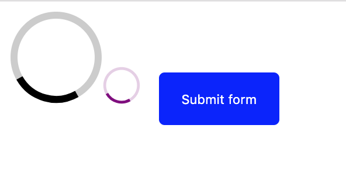
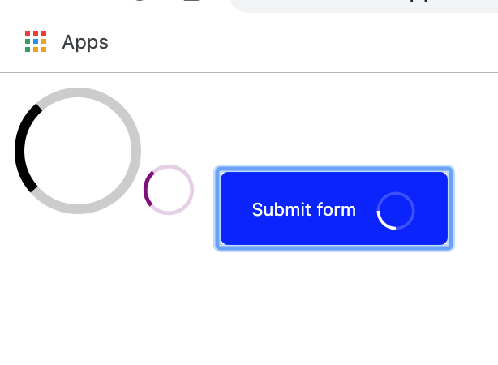

# 1015TUI-SpinnerButton

[See it live](https://codesandbox.io/s/1014tui-spinner-ddzt4?fontsize=14)

## Snapshots

<figure>
  <figcaption>Two Spinners and one ready SpinnerButton</figcaption>
  
</figure>

<figure>
  <figcaption>Two Spinners and one busy SpinnerButton</figcaption>
  
</figure>

## Notes

### Negative margin technique: How display a spinner in a button, that's taller than the button text, without making the button bigger

In the example below, I'm adding a spinner to the children of a button (alongside the button text) when the application is busy.

The Spinner is taller than the button text, so it initially stretched the button.

To solve the issue, I used negative margin on the Spinner, to give it more room, eating over the padding of the button.

TSX:

```tsx
      <button
        ...
      >
        {children}

        {isSpinning && (
          <Spinner
            title=""
            replacementClassName={
              (replacementClassNames && replacementClassNames.forSpinner) ||
              "SpinnerButton__spinner"
            }
          />
        )}
      </button>
```

CSS:

```css
.SpinnerButton__spinner {
  width: 1.5rem; /* It's only once I had set a width on the svg element that it displayed to the right on the text content */
  height: 1.5rem;
  color: white;
  vertical-align: middle;
  margin-left: 0.8rem;
  margin-top: -0.8rem;
  margin-bottom: -0.8rem; /* I'm using negative margins because the spinner is taller than the text. And I don't want the height of the button to increase*/
}
```

#### Avoiding three flashes threshold (e.g. when writing a SpinnerButton)

I was building a Spinner button and I was tempted to just show the Spinner based on the SpinnerButton's `isBusy` prop.

The problem is that, is that if we don't throttle the cadence of these visibility updates, we more be over the flash threshold.

To solve the issue, I show the Spinner based on a `isSpinning` piece of state (rather than the `isBusy` prop), and I toggle `isSpinning` true or false when `isBusy` changes, but with a 100ms delay.

```tsx
const [isSpinning, setIsSpinning] = React.useState(false);
...

useEffect(() => {
  let additionTimeoutId: number | undefined;

  // When isBusy has become true
  if (isBusy) {
    clearTimeout(additionTimeoutId);

    additionTimeoutId = setTimeout(() => {
      // trigger the isSpinning state after 100ms to avoid excessive flashes on repeat updates
      setIsSpinning(true);
    }, 100);

    // When isBusy has become false, if the spinner is spinning. (I'm adding this extra guard so that the code block doesn't run on initial page load)
  } else if (isSpinning !== false) {
    clearTimeout(additionTimeoutId);

    additionTimeoutId = setTimeout(() => {
      // trigger the isSpinning state after 100ms to avoid excessive flashes on repeat updates
      setIsSpinning(false);
    }, 100);
  }
}
```

#### Passing a `replacementClassNames` prop to a react component, to override its default className (and hence styling)

```tsx
type ReplacementClassNames = {
  forButton: string;
  forSpinner: string;
};

type Props = {
  ...
  replacementClassNames?: ReplacementClassNames;
  ...
};

export const SpinnerButton: React.FunctionComponent<Props> = ({
  ...
  replacementClassNames,
  ...
  ...rest
}) => {
  ...

  return (
    <>
      <button
        className={
          (replacementClassNames && replacementClassNames.forButton) ||
          "SpinnerButton"
        }
        onClick={handleClick}
        {...rest}
      >
        {children}

        {isSpinning && (
          <Spinner
            title=""
            replacementClassName={
              (replacementClassNames && replacementClassNames.forSpinner) ||
              "SpinnerButton__spinner"
            }
          />
        )}
      </button>
    </>
  );
};
```

### Forwarding all props (except the ones I'm intercepting) to another component

1. Pass them to another component/element inside my component using `{...props}` (or `{...rest}`, if I'm not passing all of them, because I've intercepted some for example)

2. If I want to intercept some of the props, and only pass the rest, I need to destructure the ones I want separately, then gather the rest of them in them array, and then spread the array as props.
   
   Maybe I should have done this in 2019Q41014-Disclosure, but in any case it's needed for more complex cases.
   Here's how the TenonUI Disclosure component does this:

   Notice how every prop that needs intercepting, and their value modified (as opposed to passed in directly) is destructured separately.

* Note: I don't need to declare the type of additional, unknown props

```tsx
type Props = {
  isBusy: boolean;
  onClick: (e: React.MouseEvent) => void;
  onBusyClick?: (e: React.MouseEvent) => void;
  busyAnnouncement?: string;
  completeAnnouncement?: string;
  replacementClassNames?: ReplacementClassNames;
  children: React.ReactNode;
};

export const SpinnerButton: React.FunctionComponent<Props> = ({
  isBusy,
  onClick,
  onBusyClick,
  busyAnnouncement = "App busy",
  completeAnnouncement = "Action complete",
  replacementClassNames,
  children,
  ...rest /* <= */
}) => {

  // ...

  const handleClick = isBusy ? onBusyClick : onClick;

  return (
    <>
      <div
        className="!visually-hidden"
        role="status"
        aria-live="polite"
        aria-atomic="true"
        aria-relevant="additions"
      >
        {liveAnnouncement}
      </div>

      <button
        className={
          (replacementClassNames && replacementClassNames.forButton) ||
          "SpinnerButton"
        }
        onClick={handleClick}
        {...rest} /* <= */
      >
        {children}

        {isSpinning && (
          <Spinner
            title=""
            replacementClassName={
              (replacementClassNames && replacementClassNames.forSpinner) ||
              "SpinnerButton__spinner"
            }
          />
        )}
      </button>
    </>
  );
};
```

### Cancelling scheduled timeouts, including on cleanup

If I'm using `setTimeout` to schedule an action, the schedule should be cancelled if it becomes irrelevant, and also when the component dismounts.

```tsx
  useEffect(() => {
    let additionTimeoutId: number | undefined;
    let removalTimeoutId: number | undefined;

    // When isBusy has become true
    if (isBusy) {
      // Clear the timeout so that the scheduled 'is complete' announcement gets cancelled
      // Empty the live region, so that new additions (with a 100ms buffer) will be well registered.
      clearTimeout(additionTimeoutId);
      clearTimeout(removalTimeoutId);
      setLiveAnnouncement("");

      additionTimeoutId = setTimeout(() => {
        // trigger the isSpinning state after 100ms to avoid excessive flashes on repeat updates
        setIsSpinning(true);
        setLiveAnnouncement(busyAnnouncement);

        // setLiveAnnouncement(""); /Gotcha: Do not empty a live region right after (synchronously) having populated it, as the announcement wouldn't get made/
        /* Instead, I empty the live region after a time out of 500ms */
        removalTimeoutId = setTimeout(() => {
          setLiveAnnouncement("");
        }, 500);
      }, 100);

      // When isBusy has become false, if the spinner is spinning. (I'm adding this extra guard so that the code block doesn't run on initial page load)
    } else if (isSpinning !== false) {
      // Clear the timeout so that the scheduled 'is busy' announcement gets cancelled
      // Empty the live region, so that new additions (with a 100ms buffer) will be well registered.
      clearTimeout(additionTimeoutId);
      clearTimeout(removalTimeoutId);
      setLiveAnnouncement("");

      additionTimeoutId = setTimeout(() => {
        // trigger the isSpinning state after 100ms to avoid excessive flashes on repeat updates
        setIsSpinning(false);
        setLiveAnnouncement(completeAnnouncement);

        // setLiveAnnouncement(""); /Gotcha: Do not empty a live region right after (synchronously) having populated it, as the announcement wouldn't get made/
        removalTimeoutId = setTimeout(() => {
          /* Instead, I empty the live region after a time out of 500ms */
          setLiveAnnouncement("");
        }, 500);
      }, 100);
    }

    return function cleanup() {
      clearTimeout(additionTimeoutId);
      clearTimeout(removalTimeoutId);
    };
  }, [
    isBusy,
    busyAnnouncement,
    completeAnnouncement,
    liveAnnouncement,
    isSpinning
  ]);
```

### Updating a live region, without leaving a residue message in the DOM

Considerations:
* To update a live region, it's better (for support, I believe) to first remove its content before adding new one.
But I can't add content immediately (synchronously) after I've deleting content, otherwise the fact that content was cleared won't be picked up. (At least, that's true if I'm re-adding the same content, which is a common use case).
* I believe that it's better to remove the content of a live region shortly after it's been populated, as screen reader users might come across that DOM element when navigating by element, and hear a status that might be irrelevant/confusing. But we can't remove the content of a live region right after having added it, otherwise the announcement doesn't get made. Removing the content after 500ms works (100ms is too short, I haven't tried other values).

So I follow these steps:
1. Cancel any setTimeout that might be running
2. Clear content in the live region
3. Use a setTimeout (with its id assigned to a variable called 'additionTimeout') to wait 100ms and add the new content
4. Within the callback of the addition setTimeout, use a removalSettimeout (with its id assigned to a variable called 'removalTimeout') to clear the content of the live region 500ms after I've populated it.
5. Clear both the addition and removal timeouts when the component is about to unmount

```tsx
type Props = {
  isBusy: boolean;
  // ...
  busyAnnouncement?: string;
  completeAnnouncement?: string;
  // ...
};

export const SpinnerButton: React.FunctionComponent<Props> = ({
  // ...
}) => {
  const [isSpinning, setIsSpinning] = React.useState(false);
  const [liveAnnouncement, setLiveAnnouncement] = useState("");

  useEffect(() => {
    let additionTimeoutId: number | undefined;
    let removalTimeoutId: number | undefined;

    // When isBusy has become true
    if (isBusy) {
      // Clear the timeout so that the scheduled 'is complete' announcement gets cancelled
      // Empty the live region, so that new additions (with a 100ms buffer) will be well registered.
      clearTimeout(additionTimeoutId);
      clearTimeout(removalTimeoutId);
      setLiveAnnouncement("");

      additionTimeoutId = setTimeout(() => {
        // trigger the isSpinning state after 100ms to avoid excessive flashes on repeat updates
        setIsSpinning(true);
        setLiveAnnouncement(busyAnnouncement);

        // setLiveAnnouncement(""); /Gotcha: Do not empty a live region right after (synchronously) having populated it, as the announcement wouldn't get made/
        /* Instead, I empty the live region after a time out of 500ms */
        removalTimeoutId = setTimeout(() => {
          setLiveAnnouncement("");
        }, 500);
      }, 100);

      // When isBusy has become false, if the spinner is spinning. (I'm adding this extra guard so that the code block doesn't run on initial page load)
    } else if (isSpinning !== false) {
      // Clear the timeout so that the scheduled 'is busy' announcement gets cancelled
      // Empty the live region, so that new additions (with a 100ms buffer) will be well registered.
      clearTimeout(additionTimeoutId);
      clearTimeout(removalTimeoutId);
      setLiveAnnouncement("");

      additionTimeoutId = setTimeout(() => {
        // trigger the isSpinning state after 100ms to avoid excessive flashes on repeat updates
        setIsSpinning(false);
        setLiveAnnouncement(completeAnnouncement);

        // setLiveAnnouncement(""); /Gotcha: Do not empty a live region right after (synchronously) having populated it, as the announcement wouldn't get made/
        removalTimeoutId = setTimeout(() => {
          /* Instead, I empty the live region after a time out of 500ms */
          setLiveAnnouncement("");
        }, 500);
      }, 100);
    }

    return function cleanup() {
      clearTimeout(additionTimeoutId);
      clearTimeout(removalTimeoutId);
    };
  }, [
    isBusy,
    busyAnnouncement,
    completeAnnouncement,
    liveAnnouncement,
    isSpinning
  ]);

  // ...

  return (
    <>
      <div
        className="!visually-hidden"
        role="status"
        aria-live="polite"
        aria-atomic="true"
        aria-relevant="additions"
      >
        {liveAnnouncement}
      </div>

      // ...
    </>
  );
};
```

### Building a SpinnerButton

* The component receives a `isBusy` prop. But this prop doesn't directly, immediately trigger rendering of the Spinner. What does is its `isSpinning` boolean state.
  * 100ms after `isBusy` becomes true, `isSpinning` becomes true. And conversely for false. This is to introduce throttling and avoid having more than 3 flashes per second.

* The component receives `busyAnnouncement` and `completeAnnouncement` props (with defaults set in the component. These provide the content of the announcements of a live (`role='status'`) region.
* What triggers the announcement, is a `liveAnnouncement` string piece of state that populates the live region, and gets updated.
* `liveAnnouncement` gets updated with `busyAnnouncement`, `completeAnnouncement` or `''` depending on the changes of the `isBusy` prop, but following a algorithm so that:
  * `liveAnnouncement` always gets cleared before it gets repopulated again, 100ms later
  * any scheduled clearing and repopulating of `liveAnnouncement` gets cancelled if whenever the next ones are getting scheduled (before `isBusy` has changed again, for example)
  * the content of `liveAnnouncement` gets cleared 500ms after being populated, to not polute the DOM

For more details on how this is done, see the example page and related notes.

```tsx
import React, { useState, useEffect } from "react";
import { Spinner } from "./../Spinner/Spinner";
import "./SpinnerButton.css";

type ReplacementClassNames = {
  forButton: string;
  forSpinner: string;
};

type Props = {
  isBusy: boolean;
  onClick: (e: React.MouseEvent) => void;
  onBusyClick?: (e: React.MouseEvent) => void;
  busyAnnouncement?: string;
  completeAnnouncement?: string;
  replacementClassNames?: ReplacementClassNames;
  children: React.ReactNode;
};

export const SpinnerButton: React.FunctionComponent<Props> = ({
  isBusy,
  onClick,
  onBusyClick,
  busyAnnouncement = "App busy",
  completeAnnouncement = "Action complete",
  replacementClassNames,
  children,
  ...rest
}) => {
  const [isSpinning, setIsSpinning] = React.useState(false);
  const [liveAnnouncement, setLiveAnnouncement] = useState("");

  useEffect(() => {
    let additionTimeoutId: number | undefined;
    let removalTimeoutId: number | undefined;

    // When isBusy has become true
    if (isBusy) {
      // Clear the timeout so that the scheduled 'is complete' announcement gets cancelled
      // Empty the live region, so that new additions (with a 100ms buffer) will be well registered.
      clearTimeout(additionTimeoutId);
      clearTimeout(removalTimeoutId);
      setLiveAnnouncement("");

      additionTimeoutId = setTimeout(() => {
        // trigger the isSpinning state after 100ms to avoid excessive flashes on repeat updates
        setIsSpinning(true);
        setLiveAnnouncement(busyAnnouncement);

        // setLiveAnnouncement(""); /Gotcha: Do not empty a live region right after (synchronously) having populated it, as the announcement wouldn't get made/
        /* Instead, I empty the live region after a time out of 500ms */
        removalTimeoutId = setTimeout(() => {
          setLiveAnnouncement("");
        }, 500);
      }, 100);

      // When isBusy has become false, if the spinner is spinning. (I'm adding this extra guard so that the code block doesn't run on initial page load)
    } else if (isSpinning !== false) {
      // Clear the timeout so that the scheduled 'is busy' announcement gets cancelled
      // Empty the live region, so that new additions (with a 100ms buffer) will be well registered.
      clearTimeout(additionTimeoutId);
      clearTimeout(removalTimeoutId);
      setLiveAnnouncement("");

      additionTimeoutId = setTimeout(() => {
        // trigger the isSpinning state after 100ms to avoid excessive flashes on repeat updates
        setIsSpinning(false);
        setLiveAnnouncement(completeAnnouncement);

        // setLiveAnnouncement(""); /Gotcha: Do not empty a live region right after (synchronously) having populated it, as the announcement wouldn't get made/
        removalTimeoutId = setTimeout(() => {
          /* Instead, I empty the live region after a time out of 500ms */
          setLiveAnnouncement("");
        }, 500);
      }, 100);
    }

    return function cleanup() {
      clearTimeout(additionTimeoutId);
      clearTimeout(removalTimeoutId);
    };
  }, [
    isBusy,
    busyAnnouncement,
    completeAnnouncement,
    liveAnnouncement,
    isSpinning
  ]);

  const handleClick = isBusy ? onBusyClick : onClick;

  return (
    <>
      <div
        className="!visually-hidden"
        role="status"
        aria-live="polite"
        aria-atomic="true"
        aria-relevant="additions"
      >
        {liveAnnouncement}
      </div>

      <button
        className={
          (replacementClassNames && replacementClassNames.forButton) ||
          "SpinnerButton"
        }
        onClick={handleClick}
        {...rest}
      >
        {children}

        {isSpinning && (
          <Spinner
            title=""
            replacementClassName={
              (replacementClassNames && replacementClassNames.forSpinner) ||
              "SpinnerButton__spinner"
            }
          />
        )}
      </button>
    </>
  );
};
```

#### Styling it

```css
.SpinnerButton {
  background-color: blue;
  -webkit-appearance: none;
  appearance: none;
  border: none;
  padding: 1rem 1.2rem;
  margin: 1rem;
  color: white;
  border-radius: 0.3rem;
}

.SpinnerButton__spinner {
  width: 1.5rem; /* It's only once I had set a width on the svg element that it displayed to the right on the text content */
  height: 1.5rem;
  color: white;
  vertical-align: middle;
  margin-left: 0.8rem;
  margin-top: -0.8rem;
  margin-bottom: -0.8rem; /* I'm using negative margins because the spinner is taller than the text. And I don't want the height of the button to increase*/
}
```
