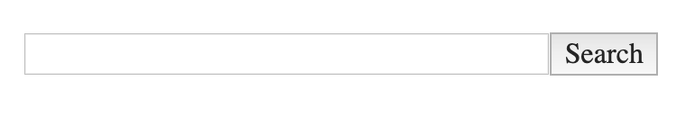
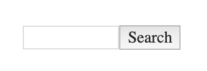
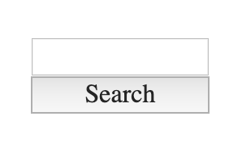

# YYYY-MM-DD-SOURCE-Name

[See it live](https://jfhector.github.io/cheat-sheets/code_examples/YYYY-MM-DD-SOURCE-Name/)

## Snapshots

<figure>
  <figcaption>Snapshot of Switch component at large viewport</figcaption>
  
</figure>

<figure>
  <figcaption>Snapshot of Switch component at medium viewport</figcaption>
  
</figure>

<figure>
  <figcaption>Snapshot of Switch component at narrow viewport</figcaption>
  
</figure>

## What does it demonstrate?

* Abc
* Abc

## Notes

* Abc
* Abc
