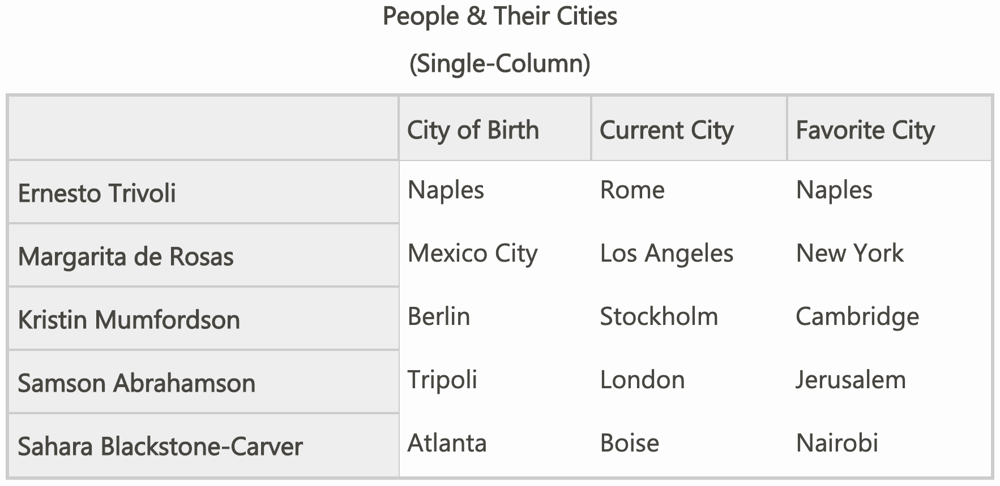
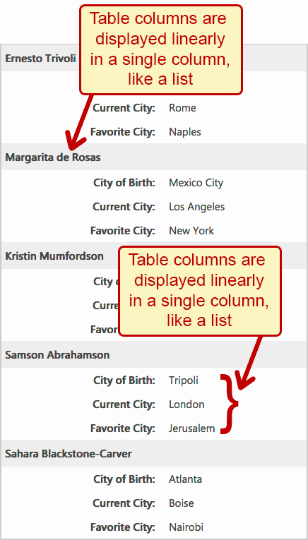

# Table

## See recommended markup and watchout in the Deque WAS course

Go there.

## Labelling a table

### Requirements

* Data tables SHOULD have a programmatically-associated caption or name.
* The name/caption of each data table SHOULD be unique within the context of other tables on the same page.

###  Related screen reader bugs/support:

* Placing the visually-hidden class directly on the <caption> tag causes the NVDA screen reader to read the table with an incorrect number of rows.

### Correct implementation examples

#### Example: using a proper caption and visible text

```html
<table>
  <caption>1st Quarter Results</caption>
  ...
</table>
```

#### Example: using visually-hidden text

```html
<table>
  <caption><span class="visually-hidden">1st Quarter Results</span></caption>
  ...
</table>
```

#### Example: using `aria-label`

But `aria-label` values are not translated by most browsers. So using the other methods is better.

```html
<table aria-label="Second quarter Results">
  ...
</table>
```

#### Example: using `aria-labelledby`

```html
<h3 id="tableCaption">Third Quarter Results</h3>
<table aria-labelledby="tableCaption">
  ...
</table>
```

#### Example: With the table inside a `figure` element, using `aria-labelledby` pointing to the `figcaption`

```html
<figure>
   <figcaption id="table_figcaption">
      Greensprings Running Club Personal Bests<br>
      (The first column lists the runners and the
      first row lists the race distances)
   </figcaption>

  <table aria-labelledby="table_figcaption">
    <tr>
      <th scope="col">Name</th>
      <th scope="col">1 mile</th>
      <th scope="col">5 km</th>
      <th scope="col">10 km</th>
      </tr>
    <tr>
      <th scope="row">Mary</th>
      <td>8:32</td>
      <td>28:04</td>
      <td>1:01:16</td>
      </tr>
    <tr>
      <th scope="row">Betsy</th>
      <td>7:43</td>
      <td>26:47</td>
      <td>55:38</td>
      </tr>
    <tr>
      <th scope="row">Matt</th>
      <td>7:55</td>
      <td>27:29</td>
      <td>57:04</td>
      </tr>
    <tr>
      <th scope="row">Todd</th>
      <td>7:01</td>
      <td>24:21</td>
      <td>50:35</td>
      </tr>
  </table>
<figure>
```

## Responsive table

### Strategy: On narrower viewports, display elements following this different pattern

#### Implementation 1: React component in Heydon Pickering's Inclusive Components

Pros:
* Simpler markup (because it's actually 2 different markups)

Cons:
* Requires JS

#### Implementation 2: Deque WAS course





Pros:
* Doesn't require JS

Cons:
* More redundant markup (i.e. all `td`s have a `data-header` attribute with the name of their `th[scope="col"]`) repeated in it. Then at narrower viewport, the content of that data attribute is used to create a `td::before` element, and the `th[scope="cole"]` are hidden, and the `td`s get `display: block;`

```html
<table id="rt">
<caption>People &amp; Their Cities <br>(Single-Column)</caption>
  <tbody><tr>
    <th scope="col">&nbsp;</th>
    <th scope="col">City of Birth</th>
    <th scope="col">Current City</th>
    <th scope="col">Favorite City</th>
  </tr>
  <tr>
    <th scope="row">Ernesto Trivoli</th>
    <td data-header="City of Birth: ">Naples</td>
    <td data-header="Current City: ">Rome</td>
    <td data-header="Favorite City: ">Naples</td>
  </tr>
  <tr>
    <th scope="row">Margarita de Rosas</th>
    <td data-header="City of Birth: ">Mexico City</td>
    <td data-header="Current City: ">Los Angeles</td>
    <td data-header="Favorite City: ">New York</td>
  </tr>
  <tr>
    <th scope="row">Kristin Mumfordson</th>
    <td data-header="City of Birth: ">Berlin</td>
    <td data-header="Current City: ">Stockholm</td>
    <td data-header="Favorite City: ">Cambridge</td>
  </tr>
  <tr>
    <th scope="row">Samson Abrahamson</th>
    <td data-header="City of Birth: ">Tripoli</td>
    <td data-header="Current City: ">London</td>
    <td data-header="Favorite City: ">Jerusalem</td>
  </tr>
  <tr>
    <th scope="row">Sahara Blackstone-Carver</th>
    <td data-header="City of Birth: ">Atlanta</td>
    <td data-header="Current City: ">Boise</td>
    <td data-header="Favorite City: ">Nairobi</td>
  </tr>
</tbody></table>
```

```css
#rt {
    width: 100%;
    border: 2px solid #ccc;
    border-collapse: collapse;
    }
#rt th, #rt td {
    padding: 3px;
    }
#rt th {
    text-align: left;
    background-color: #eee;
    padding: 5px;
    outline:1px solid #ccc;
    }

#rt td {
    padding-left: 5px;
    }

@media (max-width: 570px) {
  #rt {
      width: 100%;
      border: 2px solid #ccc;
      border-collapse: collapse;
      }
  #rt th, #rt td {
      display: block;
      padding: 3px;
      }
  #rt td::before {
      content: attr(data-header);
      font-weight: bold;
      display: inline-block;
      width: 50%;
      text-align: right;
      padding-right: 20px;
      }
  #rt th {
      text-align: left;
      background-color: #eee;
      padding: 5px;
      outline:1px solid #ccc;
      }
  #rt th[scope="col"] {
      display: none;
      }
  #rt td {
      padding-left: 5px;
      }
}
```