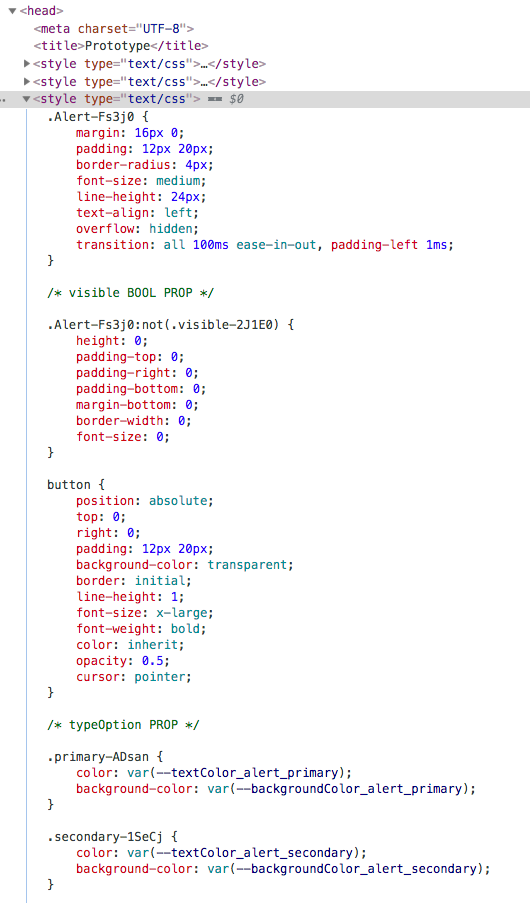

# CSS Modules

## What is it

CSS files in which all class names and animation names are scoped locally by default.

CSS Modules is not an official spec or an implementation in the browser but rather a process in a build step (with the help of Webpack or Browserify) that changes class names and selectors to be scoped (i.e. kinda like namespaced).

Instead of writing plain HTML, we need to write all of our markup in a JavaScript file, like index.js:

```js
import styles from "./styles.css";

element.innerHTML = 
  `<h1 class="${styles.title}">
     An example heading
   </h1>`;
```

During our build step, the compiler would search through that styles.css file that we’ve imported, then look through the JavaScript we’ve written and make the .title class accessible via styles.title

Our build step would then process both these things into new, separate HTML and CSS files, with a new string of characters replacing both the HTML class and the CSS selector class.

Our generated HTML might look like this:

```html
<h1 class="_styles__title_309571057">
  An example heading
</h1>
```

Our generated CSS might look like this:

```css
._styles__title_309571057 {
  background-color: red;
}
```

The classes are dynamically generated, unique, and mapped to the correct styles.

## Benefits

With CSS Modules, it’s a guarantee that all the styles for a single component:

* Live in one place
  * Note: except for global styles that don't rely on class names (e.g. apply to specific or all elements), I believe
* Only apply to that component and nothing else
* Any component can have a true dependency, like:

```
import buttons from "./buttons.css";
import padding from "./padding.css";

element.innerHTML = `<div class="${buttons.red} ${padding.large}">`;
```

BEM isn't needed any more.

## With create-react-app

CRA supports CSS Modules (alongside regular stylesheets) that use the `[name].module.css` file naming convention.

This is an optional feature. Regular `<link>` stylesheets and CSS files are fully supported. CSS Modules are turned on for files ending with the `.module.css` extension.

### Using CSS modules with create-react-app and CSS preprocessors

Should you want to preprocess a stylesheet with Sass then make sure to change the stylesheet file extension as follows: [name].module.scss or [name].module.sass.

## How to use it

### Example with React

CSS Modules allows the scoping of CSS by automatically creating a unique classname of the format `[filename]\_[classname]\_\_[hash]`.

Button.module.css:

```css
.error {
  background-color: red;
}
```

another-stylesheet.css:

```css
.error {
  color: red;
}
```

Button.js:

```js
import React, { Component } from 'react';
import styles from './Button.module.css'; // Import css modules stylesheet as styles
import './another-stylesheet.css'; // Import regular stylesheet

class Button extends Component {
  render() {
    // reference as a js object
    return <button className={styles.error}>Error Button</button>;
  }
}
```

Result:

No clashes from other .error class names.

```html
<!-- This button has red background but not red text -->
<button class="Button_error_ax7yz">Error Button</button>
```

### Note with TypeScript imports

I might need to use this syntax:

```
import * as styles from './App.css'
```

### For local class names camelCase naming is recommended, but not enforced.

This is recommended because the common alternative, kebab-casing may cause unexpected behavior when trying to access style.class-name as a dot notation. You can still work around kebab-case with bracket notation (eg. style['class-name']) but style.className is cleaner.

### Beware that CSS Modules only hash class names in selectors – not html elements

This means that only rule sets using class names in selectors are scoped locally to the component – not rulesets just using html elements.

#### Eg in `Alert.css` (version 1, with a naming conflict):

```
button {
    position: absolute;
    top: 0;
    right: 0;
    padding: 12px 20px;
    background-color: transparent;
    border: initial;
    line-height: 1;
    font-size: x-large;
    font-weight: bold;
    color: inherit;
    opacity: 0.5;
    cursor: pointer;
}

```

This would appear as, with a naming conflict:



#### Eg  in `Alert.css` (version 2, without naming conflict):

```
.button {
    position: absolute;
    top: 0;
    right: 0;
    padding: 12px 20px;
    background-color: transparent;
    border: initial;
    line-height: 1;
    font-size: x-large;
    font-weight: bold;
    color: inherit;
    opacity: 0.5;
    cursor: pointer;
}

```

This would appear as, without naming conflict:


## References

[CSS Tricks: What are CSS Modules and why do we need them?](https://css-tricks.com/css-modules-part-1-need/)

[create-react-app docs: Adding a CSS Modules Stylesheet](https://create-react-app.dev/docs/adding-a-css-modules-stylesheet)

[Official docs](https://github.com/css-modules/css-modules)

